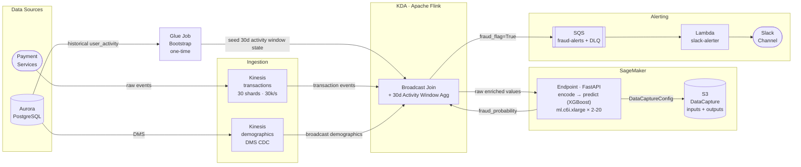

# Fraud Inference Pipeline — Design Document

## 1. Problem Statement

The data science team has delivered a trained XGBoost fraud detection model (`fraud_model.pkl`). We need to operationalise it at production scale:

- **Throughput:** ~30,000 transaction events per second via Kinesis stream
- **Feature enrichment:** each event must be joined with `user_demographic` (static lookup) and `user_activity` (rolling aggregates) before inference
- **Encoding:** features must be encoded exactly as during training
- **Alerting:** business users need real-time Slack notifications for suspicious transactions, enriched with demographic context
- **Platform:** AWS

---

## 2. Architecture Overview



---

## 3. Data Sources

Assumption：Both reference tables originate in **PostgreSQL**. They enter the real-time pipeline via different paths.

| Table | Freshness | Path into Flink |
|---|---|---|
| `user_demographic` | Minutes | DMS CDC → Kinesis → Flink broadcast state |
| `user_activity` | Historical baseline + real-time | One-time Glue bootstrap + Flink sliding window state |

### user_demographic — broadcast stream

Aurora demographic changes are captured by DMS and published to a dedicated Kinesis stream. Flink reads this as a **broadcast stream**: the demographic snapshot for every `customer_id` is held in each Flink task's local broadcast state. When a transaction arrives, the join is an in-memory lookup — no external store on the hot path.

### user_activity — Flink internal state

`user_activity` history lives in Aurora/data lake. The rolling 30-day aggregate cannot be computed purely from the Kinesis stream because the stream only carries events from pipeline start.

**Bootstrap (one-time at pipeline launch):**
A Glue job reads the last 30 days of `user_activity` from Aurora and replays events into Flink as an ordered stream. Flink ingests these into its RocksDB-backed sliding window state before the live transaction stream is opened.

The Kinesis `transactions` stream intentionally starts up ≥ 30 days before the Flink job. Once the stream has 30 days of retention (requires extended retention enabled), cold-start state can be rebuilt by replaying directly from `TRIM_HORIZON` — no Glue job needed. This is the preferred recovery path if a Flink checkpoint is ever lost (see runbook). For the initial deployment, Glue is required because Kinesis does not yet have 30 days of history.

**Overlap and deduplication:**
Glue reads Aurora up to `T₀` (Glue job start time); the Kinesis live consumer starts from `T₀ − 1h` to avoid gaps caused by clock skew or late-arriving events. The 1-hour overlap window means some events are processed twice. `ActivityAggregator` deduplicates by `event_id` using Flink `ValueState` with a 2-hour TTL — covering the overlap window without unbounded state growth.

**Real-time (ongoing):**
Every new transaction event is processed by Flink's keyed sliding window (keyed by `customer_id`). Flink maintains count / sum / avg aggregates over 24h, 7d, 30d windows entirely in internal state — no external store required.

This avoids the memory cost of storing raw events in Redis (30k/s × 30 days = billions of records) and eliminates an external dependency on the hot path.

---

## 4. Data Flow

### Step 1 — Event ingestion
Transaction events arrive on the Kinesis `transactions` stream (30 shards, partitioned by `customer_id`). Demographic change events arrive on a separate Kinesis stream via DMS CDC.

### Step 2 — Feature enrichment (Flink)

1. **Demographic join:** in-memory lookup against Flink broadcast state. No network call.
2. **Rolling aggregates:** Flink sliding window (RocksDB state) emits pre-aggregated values (tx count / sum / avg over 24h, 7d, 30d). Keyed by `customer_id` — all events for the same user are processed sequentially, no race conditions.

Flink emits raw enriched values (e.g. `gender="male"`, `subscription_type="PREMIUM"`). Categorical encoding is the inference service's responsibility (see §5.4).

### Step 3 — Inference
Flink calls the SageMaker endpoint via the AWS SDK (`sagemaker-runtime`), passing the raw enriched payload (+ `customer_id` as passthrough).

The FastAPI container:
- Loads `fraud_model.pkl` from `/opt/ml/model/` once at instance start
- Encodes categorical fields (`gender`, `subscription_type`, `income_bracket`, `channel_type`, `location`) into integer codes via `features.py`
- Runs `predict_proba` on the 9-feature vector, returns `{fraud_flag, fraud_probability}`

**DataCaptureConfig** automatically writes every request and response to S3 — no custom logging code needed.

### Step 4 — Alerting
Flink enqueues all events where `fraud_flag=True` to SQS. Lambda reads up to 10 messages per batch, retrieves the Slack webhook URL from Secrets Manager (cached in Lambda memory), and posts to Slack only for events where `fraud_probability ≥ ALERT_THRESHOLD` (Lambda env var, default 0.7).

### Step 5 — Inference log archival
DataCaptureConfig writes raw input values and fraud scores to S3, partitioned by date. Queryable via Athena for drift analysis; used as the reference dataset for Model Monitor baselines.

---

## 4a. Flink Job — Pseudocode

> See [`fraud_feat_enrich/job.py`](fraud_feat_enrich/job.py) for the full pseudocode.
>
> **TODO:** `fraud_feat_enrich/` is currently a design-level sketch. Real implementation requires PyFlink dependency setup, Kinesis connector JAR, `ActivityAggregates` dataclass, `SQSSink` implementation, and config wired from env vars.

Key points:
- Two explicit operators in the topology: `ActivityAggregator` → `EnrichAndScoreFunction`. Rolling aggregation and enrichment/scoring are separate concerns.
- `ActivityAggregator` maintains per-customer pre-aggregated buckets in RocksDB; raw events are never stored, only running sums/counts.
- `open()` is called once per Flink task. The `boto3` client and its connection pool live for the task's lifetime.
- The payload sent to SageMaker carries raw string values. Categorical encoding happens inside the FastAPI container.

---

## 5. Key Design Decisions

### 5.1 Stream processing — KDA Flink vs Lambda

| | KDA Flink | Lambda |
|---|---|---|
| Stateful windowing | Native (RocksDB-backed) | Requires external state store |
| Throughput | Millions of events/s | Expensive at 30k/s |
| Keyed processing | Guarantees per-key ordering | No ordering guarantee |
| Ops overhead | Managed by AWS | Fully serverless |

**Decision: KDA Flink.** Rolling 30-day aggregates are inherently stateful. Lambda would require every invocation to read/write an external store, adding latency and cost. Flink's keyed streams guarantee that all events for a given `customer_id` are processed sequentially by the same task.

**Rejected: PySpark Structured Streaming (Glue Streaming / EMR).**

| | Flink (KDA) | PySpark Structured Streaming |
|---|---|---|
| Processing model | True event-by-event streaming | Micro-batch (1–10 s intervals) |
| End-to-end latency | Milliseconds | Seconds |
| Live broadcast join | `KeyedBroadcastProcessFunction` — CDC stream updates broadcast state in real time | Broadcast only supports static DataFrames; CDC requires periodic full reload (minutes of lag) |
| Stateful windowing | Native RocksDB-backed state | Possible via `flatMapGroupsWithState` but operationally heavier |
| AWS managed | KDA (purpose-built for Kinesis) | Glue Streaming / EMR |

Fraud detection requires a score before the customer session ends — second-level latency is too high. The live demographic broadcast (DMS CDC) is also a blocker: PySpark cannot update a broadcast variable from a streaming source; demographic changes would lag by the reload interval. PySpark is used for the one-time Glue bootstrap job, where its batch processing strengths are appropriate.

---

### 5.2 Rolling aggregates — Flink internal state vs Redis

**Rejected: Redis sorted sets.**
Storing raw events in Redis sorted sets (for exact rolling window queries) requires:
`30,000 events/s × 86,400 s/day × 30 days = ~77 billion records`
Even distributed across users, the memory footprint is multiple terabytes — not viable.

**Decision: Flink internal state (RocksDB).**
Flink maintains pre-aggregated window values in RocksDB, disk-backed and checkpointed to S3. Memory footprint is proportional to the number of unique users, not the number of events. No external store needed for aggregates.

**Demographics** are held in Flink broadcast state (one snapshot per `customer_id`). Small, infrequently updated, fits comfortably in memory.

---

### 5.3 Inference serving — SageMaker vs ECS Fargate

Fraud detection in this pipeline is **asynchronous** — the payment is processed and committed before the fraud score is computed. Kinesis receives the transaction event in parallel; Flink enriches and scores it after the fact. A positive fraud signal triggers a Slack alert for human review and potential account action (freeze, reversal). This means inference latency does not affect the payment path.

| | SageMaker Realtime | ECS Fargate |
|---|---|---|
| Inference logging | DataCaptureConfig (built-in) | Custom (Kinesis → Firehose → S3) |
| Drift monitoring | Model Monitor (native) | Custom pipeline |
| Model / code decoupling | Native (model in S3) | Manual |
| Latency | ~8–15ms | ~1–3ms |
| Cost at 30k RPS (est.) | ~$700–1,100/mo | ~$400–600/mo |
| Scale-out speed | ~1–3 min | ~30–60s |

**Decision: SageMaker.** Because detection is asynchronous, the latency difference (~10ms) is irrelevant. The built-in DataCaptureConfig eliminates a custom inference logging pipeline, and Model Monitor integrates directly with captured data for drift alerting. Model artifact (`fraud_model.pkl`) is stored independently in S3 — data scientists can retrain and update the model without triggering a CI/CD image build.

---

### 5.4 Feature encoding — Flink vs inference service

`inference.json` defines the feature schema the **model** expects (integer-coded categoricals: `gender_code`, `subscription_type_code`, etc.). This is the model's internal contract. It does not prescribe what the **API endpoint** must accept — that is a separate design choice.

Two options were considered:

|                             | Flink encodes                                    | FastAPI encodes                                |
|-----------------------------|--------------------------------------------------|------------------------------------------------|
| Encoding language           | Java or Scala (if not PyFlink)                   | Python only                                    |
| Divergence risk             | Yes — Flink must replicate Python mapping tables | None — single source of truth in `features.py` |
| Flink knows model internals | Yes (coupled)                                    | No (decoupled)                                 |
| API schema                  | Encoded integers                                 | Raw values matching Aurora table schema        |
| DataCapture captures        | Encoded integers                                 | Raw strings                                    |
| Model Monitor baseline      | Built from encoded training data                 | Built from Aurora raw data export              |
| Encoding change scope       | Flink job + FastAPI (two deployments)            | FastAPI only (one deployment)                  |

**Decision: FastAPI encodes.**

`inference.json` is the model's internal contract; the API's public interface is a separate concern. Flink's responsibility is data enrichment — joining streams and computing rolling aggregates. Encoding categorical features is part of the model contract, not the enrichment layer.

Keeping encoding in FastAPI (`features.py`) means:
- All encoding logic is in one Python file, the same language as the training code. No risk of a Flink Java implementation silently diverging from the Python mapping tables.
- If the model is retrained with a different encoding scheme, only the FastAPI container needs updating. Flink is unaffected.
- The API accepts raw values that match the Aurora table schema (`gender VARCHAR`, `subscription_type ENUM`), which is the natural format Flink produces after enrichment.
- Flink development is less coupled to the model contract. The Flink team only needs to know the enrichment output schema (raw field types from Aurora), not the model's internal encoding requirements. Model iteration does not require Flink team coordination.

The main trade-off is that `DataCaptureConfig` captures raw strings rather than encoded integers. The Model Monitor baseline must therefore be built from a raw Aurora data export rather than the encoded training dataset. This is acceptable — Aurora data is always available, and monitoring raw value distributions (e.g., the share of `PREMIUM` subscribers) is semantically richer than monitoring integer code distributions.

---

### 5.5 Alerting path

**Decision: Flink → SQS → Lambda → Slack.**

- **Flink enqueues** all `fraud_flag=True` events. `fraud_flag` and `fraud_probability` are model outputs from SageMaker — Flink does not embed a numeric threshold.
- **Lambda applies** the alert threshold (`ALERT_THRESHOLD` env var, default 0.7). Separating the threshold from Flink means it can be tuned without redeploying or restarting the Flink job — a Lambda environment variable update takes seconds. The model's `fraud_flag` (0.5 cutoff) and the Slack alert threshold (0.7) are distinct concerns: one is the model's binary classification decision, the other is an operational sensitivity dial.
- **SQS buffers** alerts. Slack rate limits or downtime do not block Flink. DLQ + CloudWatch alarm on queue depth provide observability.
- **Lambda sends** to Slack. `reserved_concurrent_executions` caps concurrency to respect Slack rate limits.

---

## 6. Capacity Notes

| Component | Sizing |
|---|---|
| Kinesis shards | 30 × 1 MB/s = 30 MB/s; handles 30k events/s at ~1 KB/event |
| Flink parallelism | 30 (matches shard count, no repartitioning) |
| SageMaker instances | `ml.c6i.xlarge`; XGBoost on 9 features ~0.2ms compute; target 3,000 invocations/min/instance |
| SageMaker scaling | 2 instances baseline, scale to 20 on invocation rate |

---

## 7. Trade-offs and Limitations

**Flink state bootstrap complexity.** At pipeline launch, the Glue job must replay 30 days of `user_activity` into Flink state before the live stream opens. This adds operational complexity to the deployment runbook. Flink savepoints mitigate this for restarts (state is checkpointed to S3 and restored automatically).

**One-event lag on rolling aggregates.** Each event is scored using aggregates from all *previous* events, not including itself. This is correct behaviour — we predict whether the current transaction is fraudulent based on prior history — and is consistent with how the model was trained.

**SageMaker cold starts.** New instances take ~1–2 minutes to come online. At 30k RPS, sudden traffic spikes could exhaust the current instance pool before scale-out completes. Mitigate with a higher `min_capacity` baseline in production and a short scale-out cooldown (60s).

**Location encoding.** The model was trained with a `LabelEncoder` mapping location strings to integers. This artifact must be stored alongside `fraud_model.pkl` in S3 and loaded by the FastAPI container at startup (TODO — not yet implemented). Non-numeric location strings cannot be encoded until the lookup table is available.

**Rolling aggregates not yet in inference schema.** The Flink job computes per-customer 24h / 7d / 30d transaction counts and sums and passes them downstream. The current `inference.json` (v1) reflects the simplified feature set provided in the assessment and does not yet include these aggregate fields. The Flink job already computes 30-day rolling aggregates and passes them downstream. A future model version that incorporates velocity features (e.g. `tx_count_24h`, `tx_sum_7d`) only requires updating the inference schema and retraining the model artifact — no changes to the Flink job.

**Model / code release coupling.** Model updates (new `fraud_model.pkl` in S3) require updating the SageMaker endpoint configuration and triggering a blue/green deployment. Code updates (new container image) require a CI/CD build. The two lifecycles are independent but both require a deployment step.

---

## 8. CI/CD

### 8.0 AWS Account Structure

All accounts are managed under AWS Organizations.

```
Management Account   (billing, SCPs, root access only)
├── tooling account  ← ECR, Flink JAR S3, model artifact S3, CI OIDC role; all build artifacts live here
├── dev account      ← engineers iterate freely; no prod blast radius
├── sit account      ← system integration testing, mirrors prod topology
└── prod account     ← locked down; separate IAM, quotas, and audit trail
```

**Why a dedicated tooling account:**
All build artifacts (Docker images, Flink JARs, model artifacts) are produced once and shared across environments. Keeping them in a neutral tooling account avoids duplicating artifacts per environment and gives a single audit trail for what was built and when. Dev/sit/prod accounts pull from tooling via cross-account IAM — no credentials leave the tooling account boundary.

**CI/CD authentication — OIDC, no long-lived keys.**
Each account has a dedicated `github-actions-deploy` IAM role. GitHub Actions assumes it via OIDC — no AWS credentials are stored in GitHub. The tooling and dev roles trust all branches; sit and prod restrict to `main` only.

Each account has its own Terraform state bucket:

```
s3://eg-tfstate-<account-id>/fraud-inference/<component>/<env>/terraform.tfstate
```

### 8.0.1 Terraform directory structure

```
infra/
  bootstrap/src/                    ← Level 1: S3 + DynamoDB per account, local state
  components/
    github_oidc/src/ + envs/        ← Level 2: OIDC + IAM role, run locally once per account
    ecr/src/ + envs/                ← tooling account only: ECR repo + cross-account pull policy
    artifact_store/src/ + envs/     ← tooling account only: S3 for Flink JARs + model artifacts
    kinesis/src/ + envs/            ┐
    inference/src/ + envs/          │  GHA-managed (dev / sit / prod accounts)
    fraud_alert/src/ + envs/        │
    fraud_feature_pipe/src/ + envs/ ┘
    monitoring/src/ + envs/
  modules/
    sagemaker_inference/            ← reusable module, called by inference component
```

`ecr` and `artifact_store` components only have a `tooling.tfvars` + `tooling-backend.hcl` under `envs/` — they are account-scoped, not environment-scoped.

### 8.0.2 Bootstrap — one-time manual setup per account

Two levels of bootstrapping are required before GitHub Actions can take over. Both are run locally with admin credentials.

**Level 1 — State backend** (`infra/bootstrap/`)

Creates the S3 bucket and DynamoDB lock table. Uses local Terraform state because the S3 bucket doesn't exist yet. Run once per account; the generated `terraform.tfstate` is gitignored — store it securely. `allowed_account_ids` in the provider block will abort immediately if the wrong AWS profile is active.

```bash
task bootstrap ENV=dev    # repeat for sit, prod
# Output: tfstate_bucket = eg-tfstate-<account-id>
```

**Level 2 — GitHub Actions OIDC** (`infra/components/github_oidc/`)

Creates the OIDC provider and `github-actions-deploy` IAM role. Now that the S3 bucket exists this follows the same pattern as any other component — remote state, `*-backend.hcl` — but must still be run locally since GHA doesn't have its role yet.

```bash
task apply COMPONENT=github_oidc ENV=dev    # repeat for sit, prod
# Output: deploy_role_arn = arn:aws:iam::<account-id>:role/github-actions-deploy
```

After applying all four accounts, add the role ARNs to GitHub:

```
Settings → Secrets and variables → Actions → Variables:
  TOOLING_DEPLOY_ROLE_ARN = arn:aws:iam::000011112222:role/github-actions-deploy
  DEV_DEPLOY_ROLE_ARN     = arn:aws:iam::111122223333:role/github-actions-deploy
  SIT_DEPLOY_ROLE_ARN     = arn:aws:iam::444455556666:role/github-actions-deploy
  PROD_DEPLOY_ROLE_ARN    = arn:aws:iam::777788889999:role/github-actions-deploy
```

After this one-time setup, all subsequent infrastructure changes are deployed via GitHub Actions — no local AWS credentials required.

---

Three release pipelines share the same **build once, deploy anywhere** pattern: all artifacts are pushed to the tooling account on every CI run and referenced by SHA; `terraform apply` (via `deploy.yml`) is the explicit gate for each environment.

### 8.1 Inference service (FastAPI container)

```
CI — merge to main  (.github/workflows/ci.yml)
  → OIDC → tooling account
      ruff lint + pytest
      docker build --platform linux/amd64
      push → tooling ECR:{git_sha}   (one image, shared by all envs)
  → terraform plan (inference, dev)  — visibility only, no apply

Deploy  (.github/workflows/deploy.yml, workflow_dispatch)
  inputs: component=inference, env=dev|sit|prod
  → OIDC → target account (dev|sit|prod)
  → terraform apply -var="container_image=<tooling-ecr>:{image_sha}"
  → SageMaker role in target account pulls image cross-account from tooling ECR
  → SageMaker blue/green endpoint update
```

No image copy between accounts — SageMaker pulls directly from tooling ECR via cross-account IAM. The tooling ECR repository policy grants `ecr:BatchGetImage` and `ecr:GetDownloadUrlForLayer` to each environment account's SageMaker execution role.

### 8.2 Fraud model

Model artifacts live in the tooling account alongside Docker images and Flink JARs — the same build-once, reference-everywhere pattern.

```
Data science retrains model
  → fraud_model.pkl → tar.gz → s3://eg-artifacts-tooling/models/v{version}/model.tar.gz
      (uploaded to tooling account S3)

Deploy via deploy.yml (workflow_dispatch, component=inference):
  inputs: env=prod, model_version
  → terraform apply (prod)
      -var="model_s3_uri=s3://eg-artifacts-tooling/models/v{version}/model.tar.gz"
      -var="model_version=v{version}"
  → SageMaker role in prod reads artifact cross-account from tooling S3
  → SageMaker picks up new artifact (blue/green)
```

Cross-account S3 read: tooling bucket policy grants `s3:GetObject` on the `models/` prefix to each account's SageMaker execution role.

### 8.3 Flink job

```
CI — merge to main
  → OIDC → tooling account
      mvn package → fraud-pipeline-{git_sha}.jar
      upload → s3://eg-artifacts-tooling/flink/fraud-pipeline-{git_sha}.jar

Deploy via deploy.yml (workflow_dispatch, component=fraud_feature_pipe):
  → OIDC → target account (dev|sit|prod)
  → terraform apply -var="flink_jar_s3_key=flink/fraud-pipeline-{git_sha}.jar"
  → KDA role in target account reads JAR cross-account from tooling S3
  → KDA application updated, Flink job restarts
```

Cross-account S3 read: tooling bucket policy grants `s3:GetObject` to each account's KDA execution role; the KDA role policy grants `s3:GetObject` on the tooling bucket ARN.

### 8.4 Rollback

All three components roll back by reverting the Terraform variable to a previous artifact reference and re-applying. S3 and ECR retain all historical builds — no artifact is ever deleted by the pipeline.

### 8.5 Terraform boilerplate

Each component carries its own `provider.tf` (partial backend + provider block). The repetition is managed with a **Taskfile** at the repo root — a single command handles `init + plan/apply` with the right `-backend-config` and `-var-file` flags for any component/env combination:

```bash
task bootstrap ENV=dev                   # one-time account setup
task plan  COMPONENT=kinesis  ENV=dev    # init + plan
task apply COMPONENT=inference ENV=prod  # init + apply
```

`allowed_account_ids` in each `provider.tf` provides a hard guard: Terraform refuses to apply if the active AWS credentials point to the wrong account.

> **Further reduction:** Terragrunt (`root.hcl` + `path_relative_to_include()`) can generate `provider.tf` and backend config entirely, eliminating even the per-component boilerplate. Viable if the component count grows.

### 8.6 Environment promotion summary

| Trigger | Artifact | Gate |
|---|---|---|
| PR merge to `main` (`ci.yml`) | Docker image + Flink JAR → tooling account | Automated — lint + tests must pass |
| `workflow_dispatch` (`deploy.yml`) | terraform apply, any component + env | Manual — engineer selects component + env; all variable values from tfvars |
| Data science uploads model | `model.tar.gz` → tooling account S3 (`models/v{version}/`) | Manual — data science team |
| Bootstrap (one-time per account) | S3 state bucket, OIDC role, ECR, artifact S3 | Manual — local `terraform apply` with admin credentials |

No image promotion step — all environments reference the same tooling ECR image URI. "Deploying to prod" means running `deploy.yml` with `env=prod` and the desired `image_sha`.

## 9. Monitoring

### 9.1 Alert routing — three channels

Business fraud alerts, ML drift alerts, and infrastructure alerts go to separate Slack channels so the right team gets paged for the right reason.

```
Real-time fraud score ──→ Lambda ────────────────────────────────────────────────────→ #fraud-alerts    (business / ops)

                          Deequ (Data Quality)                    ┐
                          Clarify Bias P(Ŷ|group)                │ publishes directly → CloudWatch Alarm ┐
                          Model Quality P(Y|X)                   ┘                                       ├→ SNS → Chatbot → #ml-monitoring  (ML team)
Data & model drift    ──→                                                                                 │
                          SHAP drift Lambda (reads Clarify S3 → put_metric_data) → CloudWatch ───────────┤
                          PSI Lambda (Athena → put_metric_data)                  → CloudWatch ───────────┤
                          P(Ŷ) rate Lambda (put_metric_data)                     → CloudWatch ───────────┘

Infra / latency       ──→ CloudWatch Alarm → SNS → Chatbot ─────────────────────────→ #fraud-infra-ops  (platform team)
```

Lambda handles the business path (threshold logic, message formatting). CloudWatch + AWS Chatbot handle the monitoring and infra paths with zero custom code.

**AWS Chatbot one-time setup:** Slack workspace authorization requires a manual OAuth flow in the AWS Console once per account. After that, `aws_chatbot_slack_channel_configuration` is fully Terraform-managed.

---

### 9.2 Monitoring coverage

The table below maps observable distributions to tools and ground-truth requirements. Rows are ordered by deployment readiness: the upper block can be enabled immediately; the lower block depends on a confirmed-label pipeline (chargebacks) that is out of scope for this assessment.

| Distribution                   | What it detects                                                                                                                                                 | Tool                                       | Terraform resource                                                                        | Alert condition                                                                                                   | Ground truth |
|--------------------------------|-----------------------------------------------------------------------------------------------------------------------------------------------------------------|--------------------------------------------|-------------------------------------------------------------------------------------------|-------------------------------------------------------------------------------------------------------------------|--------------|
| P(X_i) — marginal statistics   | Per-feature completeness, data type, value range, categorical value set                                                                                         | Data Quality Monitor (Deequ)               | `aws_sagemaker_data_quality_job_definition` + `aws_sagemaker_monitoring_schedule`         | `violations > 0` — thresholds auto-derived from baseline `constraints.json`                                       | Not required |
| P(X_i) — marginal histogram    | Per-feature distribution shift (PSI — Population Stability Index / KS — Kolmogorov-Smirnov test)                                                                | Custom Lambda + Athena over DataCapture S3 | `aws_lambda_function` + `aws_cloudwatch_event_rule`                                       | PSI > 0.2 for any monitored feature (industry standard; 0.1–0.2 = investigate)                                    | Not required |
| P(X_i, X_j) — joint            | Correlation collapse between features                                                                                                                           | No native tool — see note                  | —                                                                                         | —                                                                                                                 | Not required |
| E[\|φ_i\|] — mean SHAP attribution | Shift in mean absolute SHAP contribution per feature; indirectly captures joint distribution changes that per-feature PSI misses | Clarify feature attribution drift | `aws_sagemaker_model_explainability_job_definition` + `aws_sagemaker_monitoring_schedule` + `aws_lambda_function` + `aws_cloudwatch_metric_alarm` | Lambda reads Clarify S3 output → `put_metric_data`; alarm fires when E[\|φ_i\|] outside baseline allowed range | Not required |
| P(Ŷ) — prediction distribution | Fraud score distribution shift; `fraud_flag` rate change                                                                                                        | CloudWatch custom metric                   | `aws_cloudwatch_metric_alarm`                                                             | `fraud_flag` rate outside business-defined range (e.g. [0.5 %, 5 %]); sustained shift in `fraud_probability` mean | Not required |
| P(Ŷ \| group) — pre-training   | Demographic group representation in live data (class imbalance metric)                                                                                          | Clarify bias monitor (pre-training)        | `aws_sagemaker_model_bias_job_definition` + `aws_sagemaker_monitoring_schedule`           | Clarify bootstrap CI for CI metric disjoint from baseline allowed range                                           | Not required |
| P(Ŷ \| group) — post-training  | Prediction fairness across demographic groups (DPPL — Difference in Positive Proportions of Predictions, DI — Disparate Impact, TVD — Total Variation Distance) | Clarify bias monitor (post-training)       | `aws_sagemaker_model_bias_job_definition` + `aws_sagemaker_monitoring_schedule`           | DPPL outside (−0.1, 0.1); DI < 0.8 (US 4/5 rule); Clarify bootstrap CI disjoint from allowed range                | Required     |
| P(Y \| X) — model quality      | AUC, precision, recall degradation over time                                                                                                                    | Model Quality Monitor                      | `aws_sagemaker_model_quality_job_definition` + `aws_sagemaker_monitoring_schedule`        | `metric_violations > 0` — thresholds auto-derived from validation-set baseline constraints                        | Required     |
| P(Y=1 \| Ŷ=p) — calibration    | Score calibration accuracy                                                                                                                                      | Custom (chargeback rate vs score bucket)   | `aws_lambda_function` + `aws_cloudwatch_metric_alarm`                                     | Chargeback rate in any score bucket deviates beyond business-defined tolerance                                    | Required     |

**On SHAP vs PSI:**
Data Quality Monitor (Deequ) and PSI both operate on individual feature marginals — neither can detect changes in the *joint* distribution of features. SHAP drift monitors the distribution of each feature's contribution to the model output given all other features, making it sensitive to correlation collapse and interaction effects that PSI misses. It also suppresses noise from features the model does not rely on. For monitoring purposes, SHAP drift is the preferred signal over PSI; PSI is a useful secondary check on data pipeline health.

Further reading: [DBShap (arXiv 2401.09756)](https://arxiv.org/abs/2401.09756) — a 2024 research paper proposing a method to decompose drift into *virtual drift* (P(X) changes) and *real drift* (P(Y|X) changes) using Shapley values. Not yet production tooling; no AWS or library support. Useful for understanding the theoretical distinction between covariate shift and concept drift.

**On joint distribution P(X_i, X_j):**
No AWS-native tool monitors this directly. A correlation-collapse scenario (e.g., `income_bracket` and `transaction_value` become decorrelated) means each feature's marginal distribution is unchanged, but the model is predicting on a feature combination never seen in training. Detectable via SHAP drift but not via Deequ or per-feature PSI.

---

### 9.2.1 Drift response strategy

Detection alone is not enough — each drift type requires a different response.

**P(X) shift (covariate / virtual drift):**

AUC (Model Quality Monitor) requires ground truth labels that arrive weeks later via chargebacks. At the moment P(X) shift is detected, labels are not yet available. Use P(Ŷ) as the immediate proxy:

```
P(X) shift detected
    ↓
Is P(Ŷ) stable? (fraud_flag rate + fraud_probability mean — no ground truth needed)
    │
    ├─ Stable → model is producing consistent predictions despite input shift
    │            monitor; wait for chargeback labels before acting
    │
    └─ Shifted → cannot distinguish genuine P(Y) change from model failure
                  act conservatively: lower ALERT_THRESHOLD (e.g. 0.7 → 0.6)
                  to increase recall while awaiting labels
    ↓
Chargebacks arrive (2–6 weeks later) → AUC / precision now computable
    │
    ├─ AUC intact → no retraining needed; restore threshold
    │
    └─ AUC degraded → retrain with importance weighting
                       up-weight training samples matching new X distribution;
                       no new labels needed for importance weighting
```

**P(Y|X) shift (concept drift / real drift) — requires ground truth:**

```
Model Quality Monitor fires (AUC drops, metric_violations > 0)
    ↓
Confirm via chargeback analysis — is the model missing new fraud patterns?
    ↓
Accumulate recent labeled data (chargebacks from past 4–8 weeks)
    ↓
Retrain on recent data → upload new model.tar.gz to tooling S3
    ↓
deploy.yml: component=inference, env=prod, model_version=vN+1
```

Concept drift cannot be resolved by threshold tuning — the model's learned mapping P(Y|X) is stale and must be replaced.

**P(X_i, X_j) joint shift (correlation collapse) — treat as P(X) shift:**

Per-feature PSI and Deequ will not fire. SHAP drift is the primary detection signal. Once confirmed, the response is the same as covariate shift: retrain with importance weighting using the current joint distribution.

---

### 9.3 Data drift monitoring

**Pre-built container — no custom code required**

Both Data Quality and Model Quality monitors use the [AWS pre-built Model Monitor container](https://docs.aws.amazon.com/sagemaker/latest/dg/model-monitor-pre-built-container.html). The `image_uri` in `data_quality_app_specification` points to AWS's own ECR image (`sagemaker-model-monitor-analyzer`). The optional `record_preprocessor_source_uri` / `post_analytics_processor_source_uri` fields are only needed for custom preprocessing and are left unset.

**Managed by Terraform** (`infra/components/monitoring/`):
- `aws_sagemaker_data_quality_job_definition` — defines what to compare and where to write reports
- `aws_sagemaker_monitoring_schedule` — runs hourly against the live endpoint's captured traffic
- `aws_cloudwatch_metric_alarm` — fires when `feature_baseline_drift_violations > 0`

**Not managed by Terraform** — baseline files produced by the ML training pipeline:

```
Training pipeline (SageMaker Processing Job)
    ↓ samples training data
    → statistics.json   (per-feature mean, std, distribution)
    → constraints.json  (acceptable range / drift thresholds)
    ↓ uploaded to S3
Terraform references via var.baseline_statistics_s3_uri
                         var.baseline_constraints_s3_uri
```

Updating the baseline after a retrain = update the S3 path variables + `task apply COMPONENT=monitoring ENV=prod`.

**What the built-in container (Deequ) actually checks:**
| Check | Features | Violation condition |
|---|---|---|
| Completeness (null rate) | all features | drops below baseline threshold |
| Data type | all features | type mismatch vs baseline |
| Value range (min/max) | transaction_value, age | current value outside baseline range |
| Categorical value set | channel_type, gender, income_bracket | new value not seen in training |

> **Note:** The built-in container does not run KS test or PSI natively — those are concepts for explaining drift, not Model Monitor outputs. For distribution-level drift (PSI / KS), options are: (a) SageMaker Clarify for feature attribution drift, or (b) a custom `record_preprocessor_source_uri` script that computes PSI/KS and emits CloudWatch custom metrics.

---

### 9.4 Model drift monitoring

**Managed by Terraform:**
- `aws_sagemaker_model_quality_job_definition` — BinaryClassification, compares `fraud_probability` predictions to ground truth
- `aws_sagemaker_monitoring_schedule` — runs daily (ground truth arrives with ~24 h lag)
- `aws_cloudwatch_metric_alarm` — fires when `metric_violations > 0`

**Hard dependency not managed by Terraform — ground truth ingestion:**

Model quality monitoring requires confirmed fraud labels to exist at `var.ground_truth_s3_uri`. These come from the fraud investigation team and are typically confirmed 24–48 h after the transaction. A separate fraud ops pipeline (out of scope for this assessment) is responsible for merging them into the expected SageMaker format.

```
Fraud ops confirms label
    ↓
Ground truth merge job → s3://eg-monitoring-{env}/ground-truth/
    ↓
Model Quality Monitor picks up on daily schedule
    ↓
Compares fraud_probability predictions → confirmed labels
    ↓
Reports AUC, precision, recall vs baseline constraints
```

**Metrics tracked:**
| Metric | Description |
|---|---|
| AUC | Overall discrimination — primary model health signal |
| Precision @ 0.5 threshold | Of flagged transactions, how many were actually fraud |
| Recall @ 0.5 threshold | Of actual fraud, how many were caught |
| fraud_probability mean | Score distribution shift over rolling 7-day window |
| fraud rate | % transactions flagged — sudden drop = model degradation, sudden spike = attack wave |

---

### 9.5 Infrastructure monitoring

CloudWatch alarms on SageMaker native metrics, routed to `#fraud-infra-ops` via AWS Chatbot:

| Alarm | Metric | Threshold |
|---|---|---|
| Latency | `ModelLatency` p99 | > 500 ms for 3 consecutive minutes |
| Errors | `Invocation5XXErrors` | > 5 in any 1-minute window |
| Volume drop | `Invocations` | < `min_invocations_per_5min` for 3 × 5 min windows |

The volume drop alarm is the upstream health signal: if Flink or Kinesis fails, invocations go to zero before any explicit health check catches it.

---

### 9.6 What Terraform manages vs what it doesn't

| Concern | Terraform | External |
|---|---|---|
| Data Quality Monitor schedule + job | ✅ | |
| Model Quality Monitor schedule + job | ✅ | |
| CloudWatch alarms + SNS topics | ✅ | |
| AWS Chatbot → Slack channel config | ✅ | One-time Slack OAuth (manual) |
| Baseline statistics / constraints | ✅ references S3 path | ML pipeline generates the files |
| Ground truth label ingestion | | Fraud ops pipeline |
